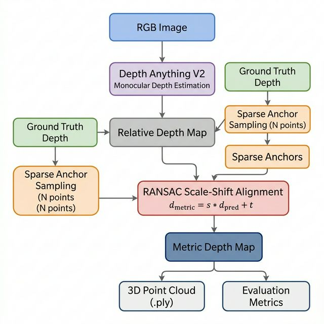

# Single-View Prediction

**Metric-Accurate 3D Reconstruction from a Single RGB Image**

This is a course project that takes a single photograph, predicts its depth using a pretrained monocular model ([Depth Anything V2](https://arxiv.org/abs/2406.09414)), corrects the prediction to real-world metric scale using a small set of known depth points, and projects the result into a 3D point cloud.

---

## The Problem

Monocular depth models like Depth Anything V2 produce dense, detailed depth maps from a single image, but their output is in an arbitrary relative scale -- not in meters. You cannot directly use it for any real-world measurement or 3D reconstruction.

Classical methods like Structure-from-Motion give you metric accuracy, but only at sparse points and they fail in textureless or reflective regions.

**Our approach:** We combine the best of both. We take the dense relative depth from the monocular model and anchor it to metric scale using just a handful of sparse points with known depth. A RANSAC-based linear fit recovers the global scale and shift, giving us a dense metric depth map that we then project into 3D.

---

## Pipeline



| Stage | What happens |
|:------|:-------------|
| 1. Data Loading | Load RGB image, ground truth depth, and camera intrinsics from NYU Depth V2 |
| 2. Depth Prediction | Run Depth Anything V2 (Large) to get a dense relative depth map |
| 3. Alignment | Sample N sparse points from GT depth, fit `d_metric = s * d_pred + t` via RANSAC |
| 4. 3D Projection | Back-project every pixel into (X, Y, Z) using the pinhole camera model, export `.ply` |
| 5. Evaluation | Compare aligned depth against GT using AbsRel, RMSE, and delta < 1.25 |

---

## Project Structure

```
Single-View_Prediction/
|
|-- src/                          Core library
|   |-- config.py                 Default settings (model, paths, camera params, RANSAC)
|   |-- dataloader.py             NYU Depth V2 folder-based dataset loader
|   |-- depth_estimator.py        Depth Anything V2 inference wrapper
|   |-- aligner.py                Sparse anchor sampling + RANSAC alignment
|   |-- projector.py              Pinhole back-projection and .ply export
|   |-- visualizer.py             Plotting (depth comparison, error maps, sparsity curves)
|   |-- metrics.py                Evaluation metrics (AbsRel, RMSE, delta)
|
|-- scripts/                      Entry points
|   |-- run_pipeline.py           Full end-to-end pipeline on a single image
|   |-- evaluate.py               Batch evaluation over multiple images
|   |-- sparsity_analysis.py      RMSE vs number of anchors sweep
|
|-- nyu_data/                     Dataset (downloaded separately)
|   |-- data/
|       |-- nyu2_train.csv        CSV manifest for training split
|       |-- nyu2_test.csv         CSV manifest for test split
|       |-- nyu2_train/           RGB + depth PNG pairs
|       |-- nyu2_test/            RGB + depth PNG pairs
|
|-- outputs/                      Generated results (gitignored)
|-- requirements.txt
|-- README.md
```

---

## Module Descriptions

### `src/config.py`
All default hyperparameters live in a single dictionary here -- model name, dataset path, NYU camera intrinsics (fx, fy, cx, cy), RANSAC settings (iterations, threshold, min samples), and output paths. Change this file first if you want to modify any defaults.

### `src/dataloader.py`
Defines `NYUDepthV2Dataset`, a PyTorch Dataset that reads from the folder-based Kaggle download using CSV manifests (`nyu2_train.csv` / `nyu2_test.csv`). Each CSV line contains `image_path,depth_path` pointing to PNG files. Each sample returns an RGB image tensor, a ground truth depth map in meters, and the 3×3 intrinsic matrix K. A `get_sample()` convenience function is also included for quick NumPy access.

### `src/depth_estimator.py`
`DepthEstimator` loads Depth Anything V2 Large from HuggingFace Transformers and runs inference. Accepts PIL images, NumPy arrays, or PyTorch tensors. Returns a (H, W) relative depth map upsampled to the original image resolution.

### `src/aligner.py`
Two classes:
- `SparseAnchorSampler` -- randomly picks N valid pixels from the GT depth map (simulating what a LiDAR or SfM system would provide).
- `RANSACAligner` -- fits a linear model (`d_metric = s * d_pred + t`) using RANSAC to reject outlier anchors. The `align()` method applies the recovered scale and shift to the full prediction.

### `src/projector.py`
`PointCloudProjector` converts the metric depth map to 3D coordinates using standard pinhole equations:
```
Z = depth(u, v)
X = (u - cx) * Z / fx
Y = (v - cy) * Z / fy
```
Exports colored point clouds as `.ply` files via Open3D.

### `src/visualizer.py`
Plotting helpers:
- `plot_depth_comparison()` -- side-by-side: RGB, raw prediction, aligned prediction, ground truth
- `plot_error_map()` -- per-pixel absolute error heatmap
- `plot_sparsity_curve()` -- RMSE vs N plot for the sensitivity study

### `src/metrics.py`
Implements evaluation metrics standard in depth estimation literature:
- **AbsRel** -- mean of |pred - gt| / gt (lower is better)
- **RMSE** -- root mean squared error in meters (lower is better)
- **delta < 1.25** -- fraction of pixels where max(pred/gt, gt/pred) < 1.25 (higher is better)

---

## Requirements

- Python 3.10+
- CUDA-capable GPU with at least **4 GB VRAM**
- ~4 GB disk space for the dataset
- ~1.3 GB for model weights (auto-downloaded on first run)

**Tested on:** RTX 3050, RTX 3060, T4, A100. If you have less VRAM, switch to a smaller model variant in `src/config.py`. You can also run this on Google Colab (T4 runtime) or Lightning AI.

---

## Setup

**1. Clone and install dependencies**

```bash
git clone https://github.com/ankur777jinn/Single-View_Prediction.git
cd Single-View_Prediction

python -m venv venv
source venv/bin/activate        # Linux / Mac
venv\Scripts\activate           # Windows

pip install -r requirements.txt
```

**2. Download the dataset**

Download the NYU Depth V2 dataset from Kaggle:
https://www.kaggle.com/datasets/soumikrakshit/nyu-depth-v2

Unzip the archive into the project root so the dataset is at `nyu_data/`:

```bash
unzip archive.zip
```

This creates the following structure:
```
nyu_data/data/nyu2_train.csv
nyu_data/data/nyu2_test.csv
nyu_data/data/nyu2_train/   (image + depth PNG pairs)
nyu_data/data/nyu2_test/    (image + depth PNG pairs)
```

You can also pass a custom dataset path using the `--data` flag in any script.

---

## How to Run

Run all scripts from the project root.

**Full pipeline (single image):**
```bash
python scripts/run_pipeline.py --index 0 --anchors 100
```
Runs depth estimation, alignment, and 3D projection on one image. Saves the point cloud (`.ply`), comparison plots, and error maps to `outputs/`. Prints evaluation metrics to the terminal.

Flags: `--index` (image number), `--anchors` (number of GT points), `--data` (dataset folder path), `--device cpu` (if no GPU), `--no-viz` (skip plots).

**Batch evaluation:**
```bash
python scripts/evaluate.py --num-images 50 --anchors 100
```
Evaluates the full pipeline on 50 images and prints a summary table (mean and std of all metrics). Saves results to `outputs/eval_results.txt`.

**Sparsity sensitivity analysis:**
```bash
python scripts/sparsity_analysis.py --num-images 20
```
Runs the alignment with N = {5, 10, 50, 100, 500} anchors and plots how RMSE changes. Saves the plot to `outputs/sparsity_sensitivity.png`.

---

## References

1. Eigen, D., Puhrsch, C., & Fergus, R. (2014). Depth Map Prediction from a Single Image using a Multi-Scale Deep Network. [arXiv:1406.2283](https://arxiv.org/abs/1406.2283)

2. Yang, L., Kang, B., Huang, Z., Zhao, Z., Xu, X., Feng, J., & Zhao, H. (2024). Depth Anything V2. [arXiv:2406.09414](https://arxiv.org/abs/2406.09414)

3. Eigen, D. & Fergus, R. (2015). Predicting Depth, Surface Normals and Semantic Labels with a Common Multi-Scale Convolutional Architecture. [arXiv:1411.4734](https://arxiv.org/abs/1411.4734)
